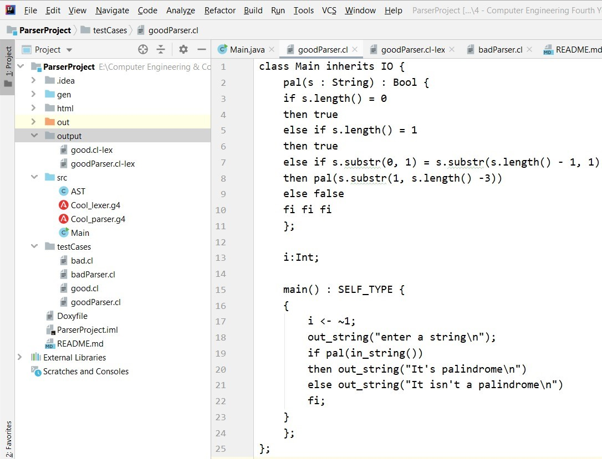
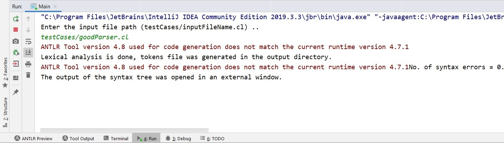
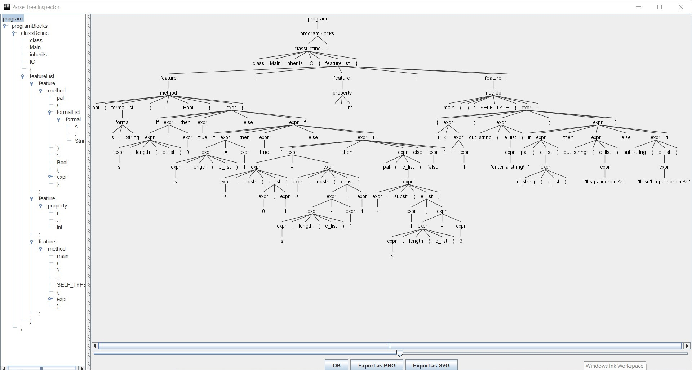
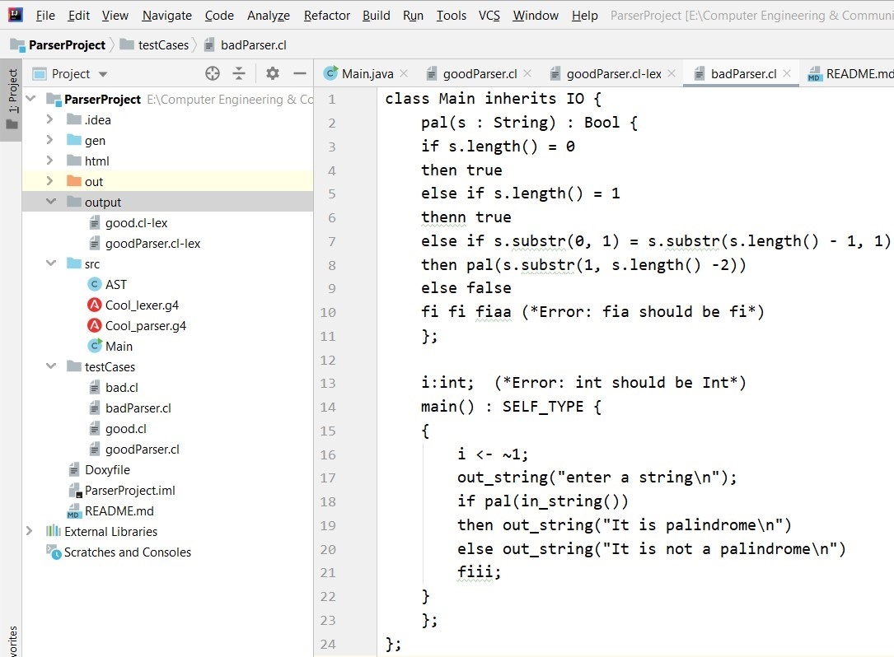
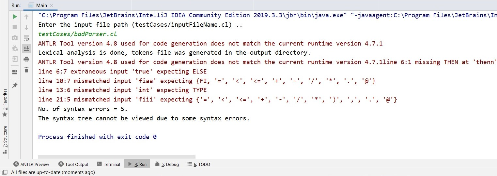

# Cool Compiler Project (Part II)
## Compiler's project overview:

This project will direct you to design and build an interpreter for Cool. Each phase will cover one component of the interpreter:    lexical analysis, parsing, and code generation in three address code. Each phase will ultimately result in a working compiler phase which can interface with the other phases.

## Pre - Steps:
1) Install any ide such as Intellij, NetBeans (Intellij is preferred).
2) Follow this [link](https://docs.google.com/document/d/1LZq93o6nc8j_m212T5monJFApjqdmuyK8uvRKLwuCok/edit) to complete ANTLR V4 configuration.
3) Generate the grammar (in this project they are: **Cool_lexer.g4** & **Cool_parser.g4**), right click for each file and Generate Antlr Recognizer.
4) File -> Project Structure -> Sources -> right click on (gen) -> choose sources -> remove (gen) from tests.

#### Note That:
This project is considered to be the second part of the **"Cool Compiler Project"**, for the first part **(Lexical Analysis)**, follow this [link](https://github.com/KarimMohamedTalaat/CompilerProjects/tree/master/lexerProject).

## The second phase ( Parsing )
### Goal :
- **A parser** is a software component that takes input data (frequently text) and builds a data structure – often some kind of parse tree, abstract syntax tree **(AST)** or other hierarchical structure, giving a structural representation of the input while checking for correct syntax. The parsing may be preceded or followed by other steps, or these may be combined into a single step. The parser is often preceded by a separate lexical analyser, which creates tokens from the sequence of input characters.

- Parsing or syntactic analysis, which is checking that the tokens form an allowable expression. This is usually done with reference to a context-free grammar which recursively defines components that can make up an expression and the order in which they must appear. 

- **Types of parsers:** 
1) **Top-down parsing** - which can be viewed as an attempt to find left-most derivations of an input-stream by searching for parse trees using a top-down expansion of the given formal grammar rules. Tokens are consumed from left to right.
2) **Bottom-up parsing** - A parser can start with the input and attempt to rewrite it to the start symbol. Intuitively, the parser attempts to locate the most basic elements, then the elements containing these, and so on.
- **In this project, the type which was used is the top-down parsing.**

### Specifications :
1) A program that takes a single command-line argument (e.g., file.cl-lex). That argument will be an ASCII text Cool tokens file (as described in the lexer programming assignment). The cl-lex file will always be well-formed (i.e., there will be no syntax errors in the cl-lex file itself). If your program is called parser, invoking parser file.cl-lex should yield the same output as cool --parse file.cl. Your program can take another argument which is the file to print the output of the Concrete Syntax Tree (CST) as follows: parser file.cl-lex file.cl-cst. Your program should determine and print any errors in the parsing tree and terminate the program.

2) Test cases **goodParser.cl** and **badParser.cl**. The first should parse correctly and yield an abstract syntax tree. The second should contain an error.

### Steps :
1) Run the Main file.

2) Type the cool input file path as follows: **"testCases/inputFileName.cl"**.
##### Note that:
* Here we have two given files with the project stored in **testCases** directory to check the parser, **"goodParser.cl"** & **"badParser.cl"**, first one passes the lexical phase correctly and gives an output file with lexical tokens in the **output** directory under the name of **"goodParser.cl-lex"** then the parsing phase comes to view an abstract syntax tree in an external window, second one cannot lex due to some reported errors.

* The output file for the good cool syntax includes all tokens with detailed info about the line no., type and value.

* The external JFrame window contains the **hierarchical tree structure** of the program, this graphed tree illustrates in detail all nested components which forms all the program.
### Shots :
#### For the **"goodParser.cl"** input cool file, here are some shots for the following:
- **Cool source code :**

- **Run command & some info :**

- **The output hierarchical tree structure (AST) :**

#### For the **"badParser.cl"** input cool file, here are some shots for the following:
- **Cool source code :**

- **Run command & syntax errors were found :**

