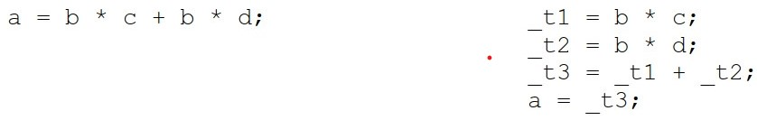
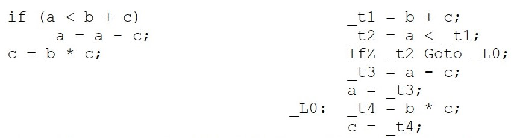
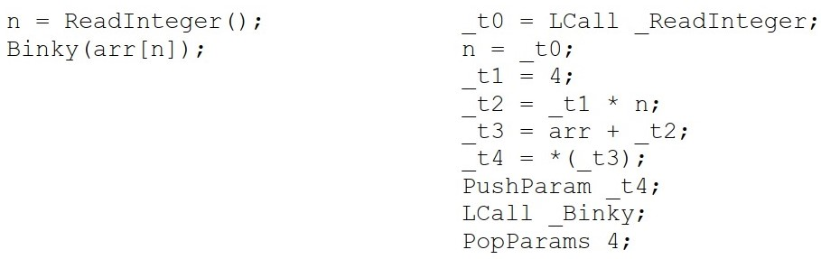
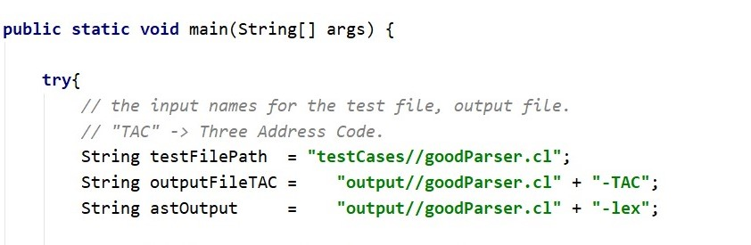
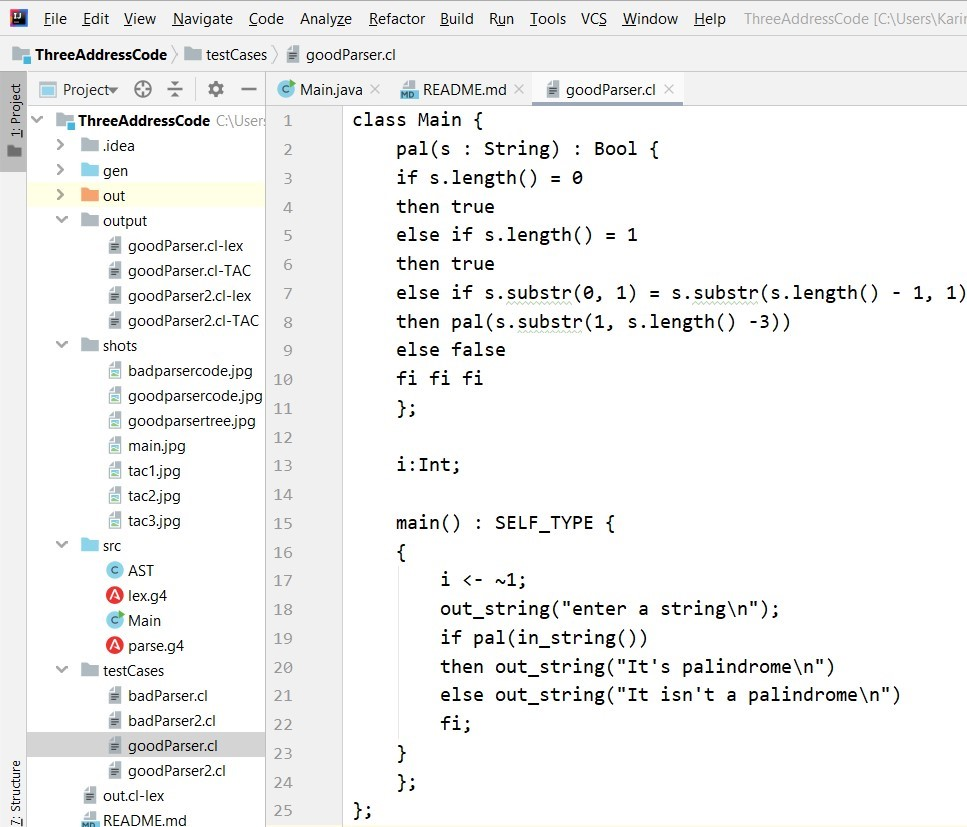
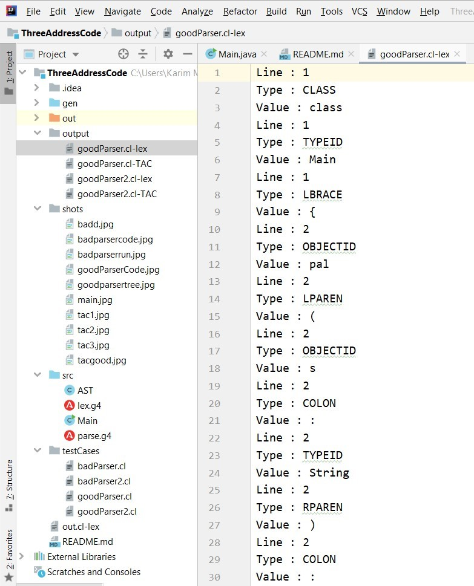
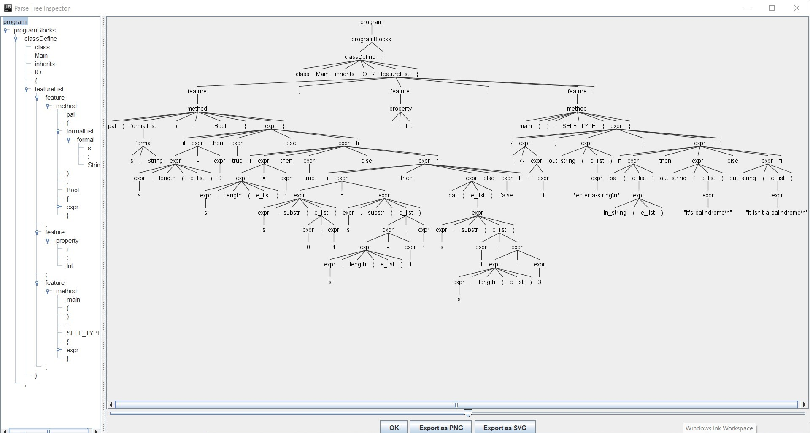
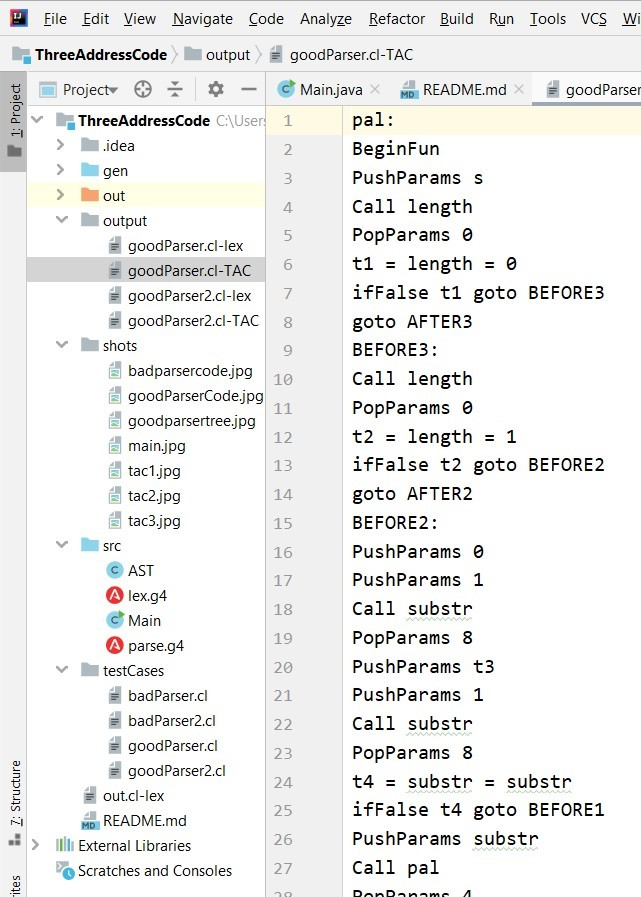
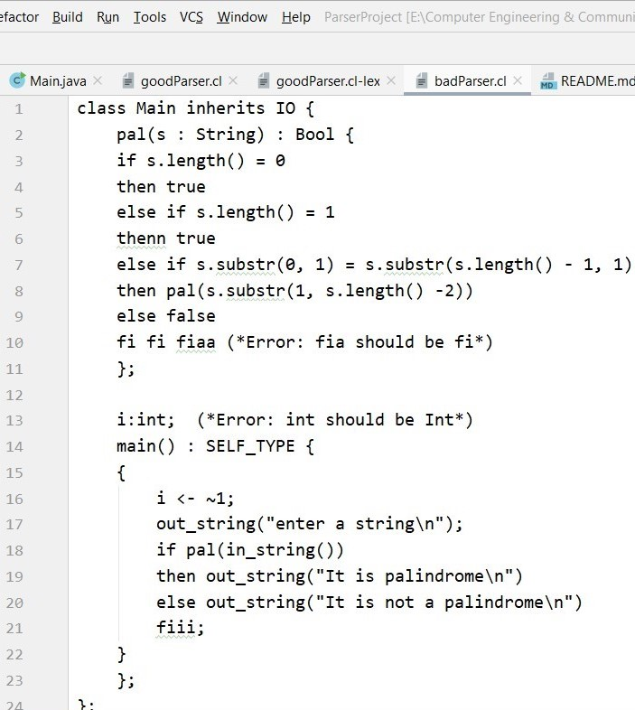
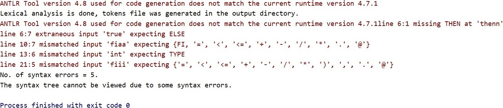

# Cool Compiler Project (Part III)
## Compiler's project overview:

This project will direct you to design and build an interpreter for Cool. Each phase will cover one component of the interpreter:    lexical analysis, parsing, and code generation in three address code. Each phase will ultimately result in a working compiler phase which can interface with the other phases.

## Pre - Steps:
1) Install any ide such as Intellij, NetBeans (Intellij is preferred).
2) Follow this [link](https://docs.google.com/document/d/1LZq93o6nc8j_m212T5monJFApjqdmuyK8uvRKLwuCok/edit) to complete ANTLR V4 configuration.
3) Generate the grammar (in this project they are: **lex.g4** & **parse.g4**), right click for each file and Generate Antlr Recognizer.
4) File -> Project Structure -> Sources -> right click on (gen) -> choose sources -> remove (gen) from tests.

#### Note That:
This project is considered to be the third part of the **"Cool Compiler Project"**, for the first part **(Lexical Analysis)** follow this [link](https://github.com/KarimMohamedTalaat/CompilerProjects/tree/master/lexerProject), 
and for the second part **(Parsing)** follow this [link](https://github.com/KarimMohamedTalaat/CompilerProjects/tree/master/ParserProject).
- The full project [repository](https://github.com/KarimMohamedTalaat/CompilerProjects), contains all parts.

## The third phase ( Three Address Code Generation )
### TAC Intro :
- Three­address code **TAC** will be the intermediate representation used in our Decaf
  compiler. It is essentially a generic assembly language that falls in the lower­end of the
  mid­level IRs. Some variant of 2, 3 or 4 address code is fairly commonly used as an IR,
  since it maps well to most assembly languages. A TAC instruction can have at most
  three operands. The operands could be two operands to a binary arithmetic operator
  and the third the result location, or an operand to compare to zero and a second
  location to branch to, and so on. For example, below on the left is an arithmetic
  expression and on the right, is a translation into TAC instructions:
  
- Notice the use of temp variables created by the compiler as needed to keep the number
  of operands down to three. Of course, it's a little more complicated than the above
  example, because we have to translate branching and looping instructions, as well as
  function and method calls. Here is an example of the TAC branching instructions used
  to translate an if­statement:
  
- And here is an example of the TAC translation for a function call and array access:
  
  
- For more details and for your reference, kindly check these two links,
[video](https://www.youtube.com/watch?v=4OxMAeNsTUY)  to see an example of generating the three address code for the C-language. The idea is the same for the COOL-language for sure,
Please, check also this [document](https://web.stanford.edu/class/archive/cs/cs143/cs143.1128/handouts/240%20TAC%20Examples.pdf) to see how function calls are handled in three address code.

### Goal :
- So, the final output of the project is to generate the three address code of the input COOL program, 
passing through **lexical analysis**, **parser**, and **three address code generator**.

### Specifications :
1) A program that takes a single input file (e.g., file.cl). That argument will be an ASCII text Cool tokens file (as described in the lexer programming assignment). The cl-lex file will always be well-formed (i.e., there will be no syntax errors in the cl-lex file itself), the program determines and print any errors in the parsing tree and terminate the program.

2) Test cases **goodParser.cl**, **goodParser2.cl** and **badParser.cl**, **badParser2.cl**. The first two files parse correctly and yield an abstract syntax tree,
then the three address code file **TAC** is generated in the output directory, but the second two files contain errors, the program terminates.

### Steps :
1) Run the Main file.

2) Type the cool input file path as follows: **"testCases/inputFileName.cl"**.

##### Note that:
* Here we have four given files with the project stored in **testCases** directory to check the three address code generator, **"goodParser.cl"**, **"goodParser2.cl"** & **"badParser.cl"**, **"badParser2.cl"** first two files passes the lexical phase correctly and gives an output file with lexical tokens in the **output** directory under the name of **"goodParser.cl-lex"** then the parsing phase comes to view an abstract syntax tree in an external window, second two files cannot continue these compiling steps due to some reported errors.

* The output file for the good cool syntax with the extension **lex**, includes all tokens with detailed info about the line no., type and value.

* The output file for the good cool syntax with the extension **TAC**, includes the detailed generated three address code.

* The external JFrame window contains the **hierarchical tree structure** of the program, this graphed tree illustrates in detail all nested components which forms all the program.
### Shots :
#### For the **"goodParser.cl"** input cool file, here are some shots for the following:
- **Cool source code :**

- **(1) The lexer Step : Output token files :**

- **(2) The parser Step : Output hierarchical tree structure (AST) :**

- **(3) The three address code generator step : Detailed output file (TAC) :**

#### For the **"badParser.cl"** input cool file, here are some shots for the following:
- **Cool source code :**

- **Syntax errors were found, then termination:**

